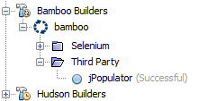

nb-bamboo-plugin
===

NetBeans Plugin for Atlassian's Bamboo CI server
---

The features of this plugin are similar to those of the Hudson Builders.

Support for:

* open in browser
* synchronization
* notification when a build failed and is back to successful
* disable notification
* queue a build
* show changes
* show Jira issues

